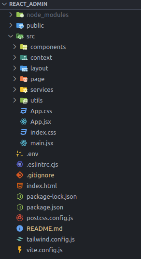

# MOR MINI PROJECT

This project is a React CMS application for managing a toy store.

The purpose of this project is providing RESTful APIs and services for the [Web App](https://github.com/thanhmoe/Reactjs_Lego_Eshop.git) and [CMS App](https://github.com/thanhmoe/react_admin.git)

## Prerequisites

Before you begin, ensure you have met the following requirements:

- Node.js (v20.x or higher)
- npm (v10.x or higher)
- Git (v2.x or higher)
- The server running (Visit [express-boilerplate](https://github.com/KienPT2607-IT/express-boilerplate.git))

## Installation

1. **Clone the repository**

   ```bash
   https://github.com/thanhmoe/react_admin.git
   cd react_admin
   ```

2. **Install dependencies**

   ```bash
   npm install
   ```

3. **Set up environment variables**

   Create a `.env` file in the root directory and add the following variables:

   ```plaintext
   VITE_SERVER_BASE_URL=Your_server_url
   ```

   - VITE_SERVER_BASE_URL: your server base URL

4. **Set up the server**

   - Ensure MySQL is running.
   - Ensure Redis server is running
   - Ensure the server installed and configured

   ```bash
   npm start
   ```

   The server utilizes nodemon dependency for auto restart server when files change for better coding experience

   The server should now be running at `http://localhost:3000`.

5. **Start the app**

   ```bash
   npm run dev
   ```

   The server should now be running at `http://localhost:5173/`.

## Directory Structure



- **public/**: Contains assets (local/ upload images, videos).
- **src/**: Source files.
  - **components/**: Contains route components.
  - **context/** : Contains authorization files
  - **layout/**: Contains layouts.
  - **page/**: Contains view templates.
  - **services/**: Contains services functions.
  - **utils/**: Contain utility functions
- **.env**: Environment variables
- **index.html**: The root file of the view structure.
- **package.json**: Project dependencies and scripts.
- **vite.config.js**: The Vite configuration.
- **tailwind.config.js**: The tailwind css configuration.

## Contact

If you have any questions, please contact me at

- kien.pt@mor.com.vn
